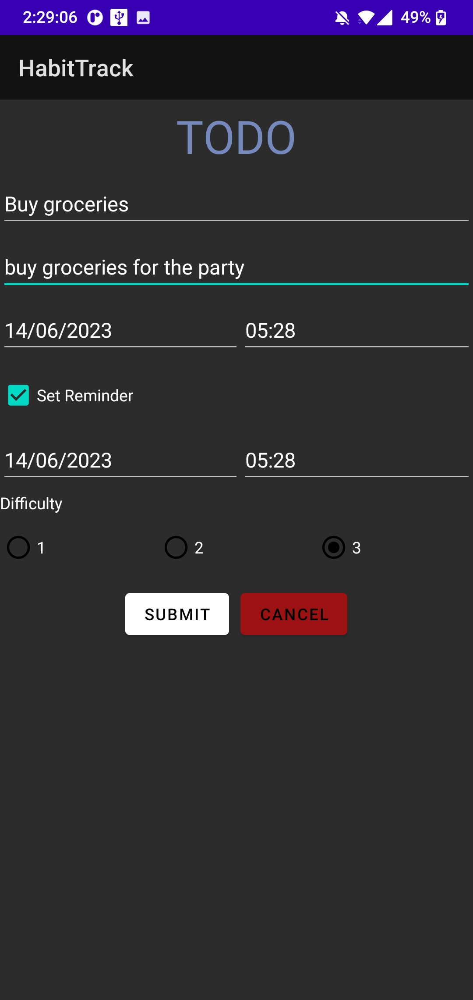
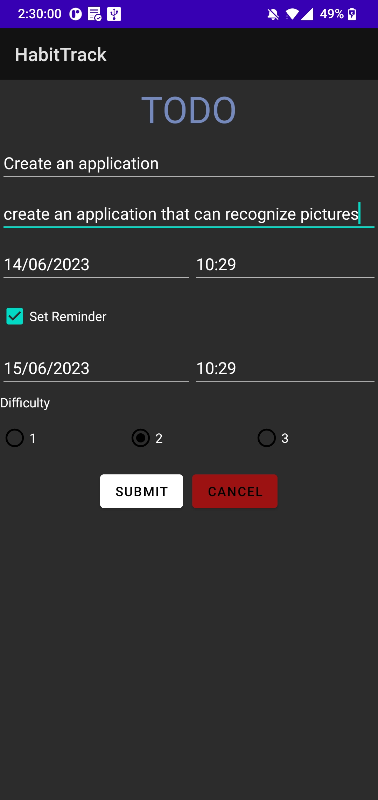
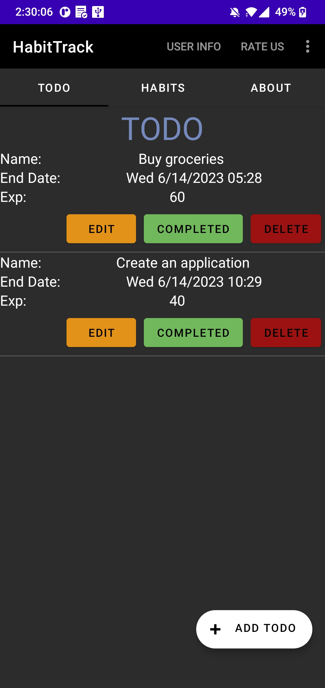
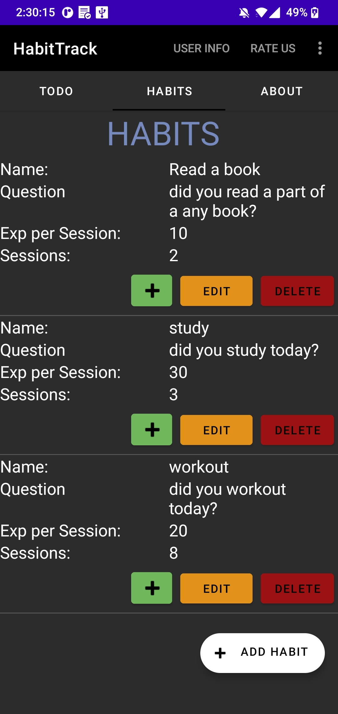
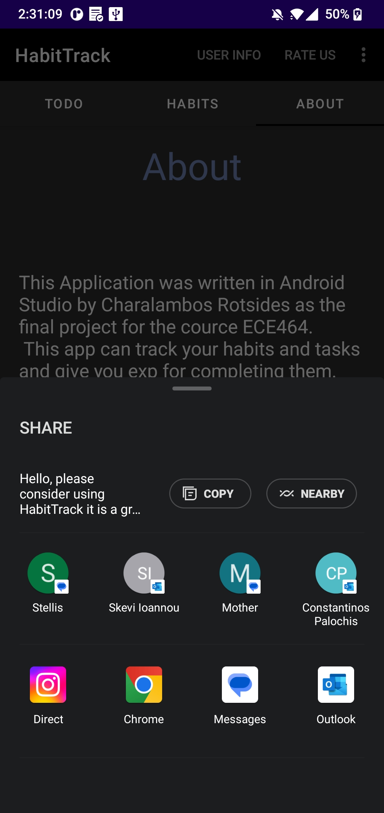
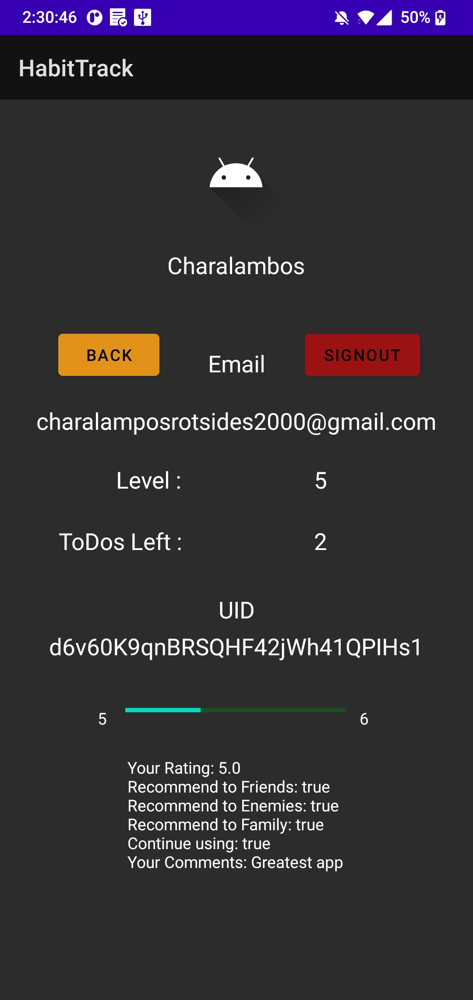
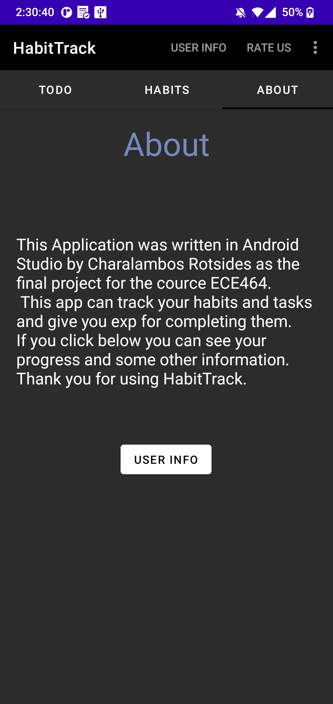
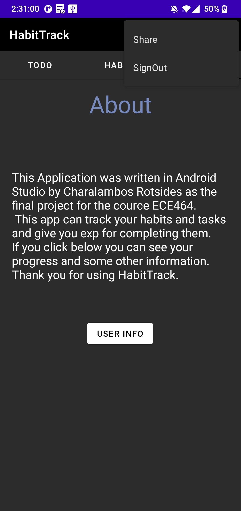

# HabitTrack

This Application was written in Android Studio using Java by Charalambos Rotsides as the final project for the course ECE464. This application can track your habits and tasks and give you experience in completing them. This application uses Firebase to store login and personal information such as tasks, experience, level, and habits.

## Getting Started

These instructions will get you a copy of the project up and running on your local machine for development and testing purposes.

### Prerequisites

What things you need to install the software and how to install them.

- Android Studio: You can download it from https://developer.android.com/studio
- Java SDK: Android Studio requires the Java SDK, it can be downloaded from https://www.oracle.com/java/technologies/javase-jdk11-downloads.html
- Google Firebase Account: You need to have a Firebase account to manage the real-time backend of the application. Sign up at https://firebase.google.com/

### Installation

1. Clone this repository: `git clone https://github.com/ChRotsides/HabitTrack.git`
2. Open the project in Android Studio: `File > Open > select the project`
3. Connect the project with Firebase: `Tools > Firebase > (Choose your Firebase service) > Connect to Firebase`
4. Wait for the Gradle sync to finish and then build the project: `Build > Make Project`
5. Run the app: `Run > Run 'app'`

## Built With
- Android Studio - The IDE used
- Java - The language used
- Firebase - Mobile platform used for developing high-quality apps

## Application Screens

Authors
Charalambos Rotsides
